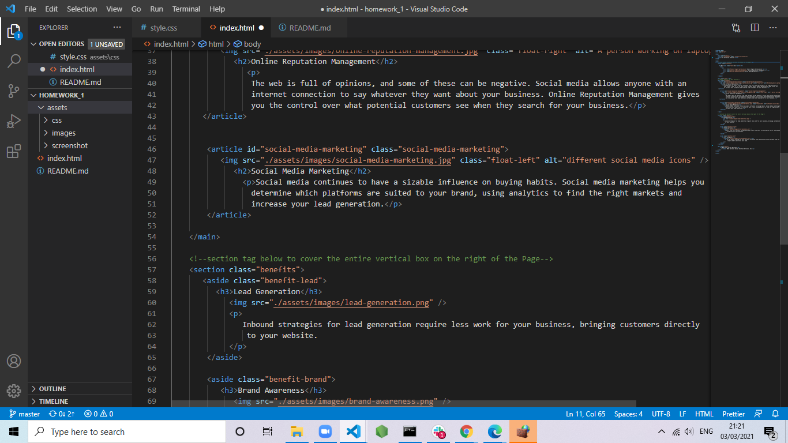
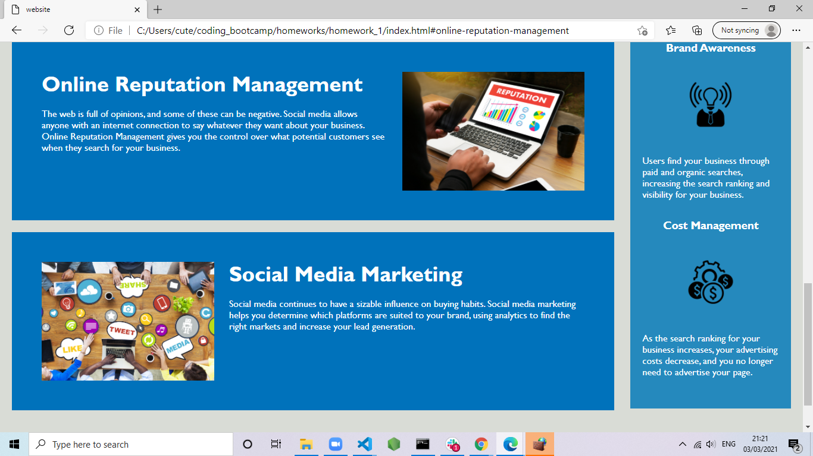
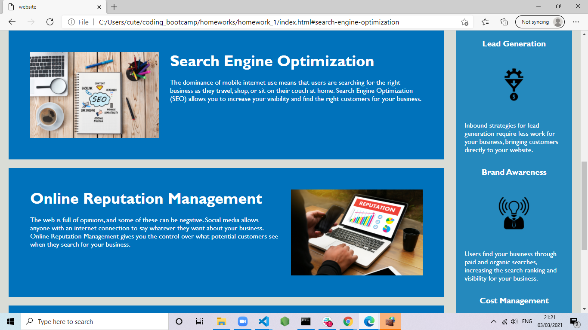
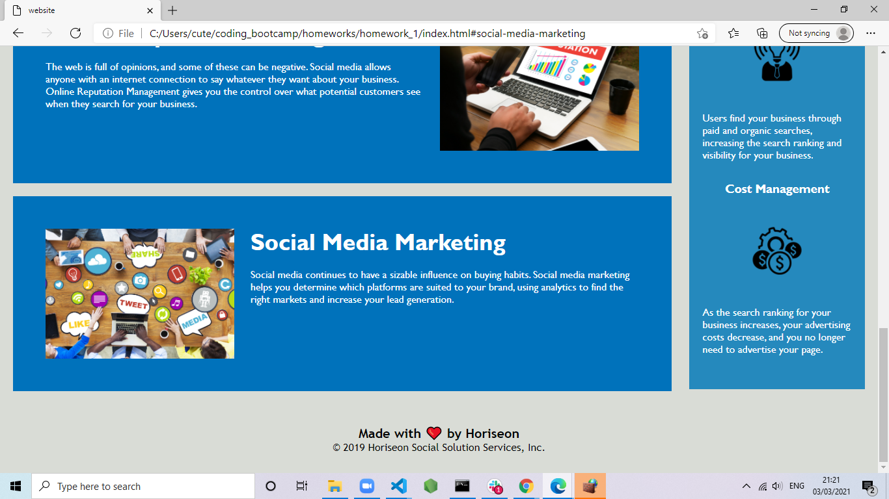

# SEO MARKETING WEBSITE

This Project was given to make the code developer friendly and the site user friendly.it was good challenging project
to check my ability and what i am capable of.i have made many changes in the project to fulfill the requirments some of them are as below.

- i have changed the Title of the website to the Name i think is suitable.

- added semantic elements like "Main" or "section" etc in the Html.

- The vertical box on the right side added that in the "aside" element so the the developer can find it better.

- When the file was given the code were looking messy and not in nice order,i have put the code in nice order so the developer can understand better.

- i have added some comments in html and CSS on some of the changes i have made.

- in the CSS the code was very lenghty because same style were used for multiple element multiple time,i used the CSS combinators to apply the single style on multiple items.

- made sure that css is matching the html and deleted some extra code which could be avoided by adding some css styles.

## deployed URL

https://mrasheed1991.github.io/homework_1/.
